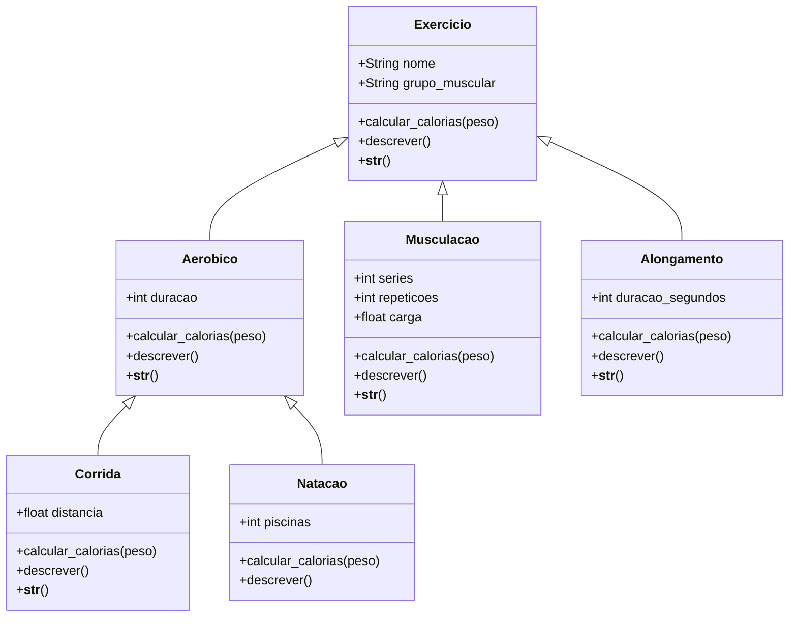

```mermaid
classDiagram
    class Exercicio {
        +String nome
        +String grupo_muscular
        +calcular_calorias(peso)
        +descrever()
        +__str__()
    }

    class Aerobico {
        +int duracao
        +calcular_calorias(peso)
        +descrever()
        +__str__()
    }

    class Corrida {
        +float distancia
        +calcular_calorias(peso)
        +descrever()
        +__str__()
    }

    class Natacao {
        +int piscinas
        +calcular_calorias(peso)
        +descrever()
    }

    class Musculacao {
        +int series
        +int repeticoes
        +float carga
        +calcular_calorias(peso)
        +descrever()
        +__str__()
    }

    class Alongamento {
        +int duracao_segundos
        +calcular_calorias(peso)
        +descrever()
        +__str__()
    }

    Exercicio <|-- Aerobico
    Exercicio <|-- Musculacao
    Exercicio <|-- Alongamento
    Aerobico <|-- Corrida
    Aerobico <|-- Natacao
```
